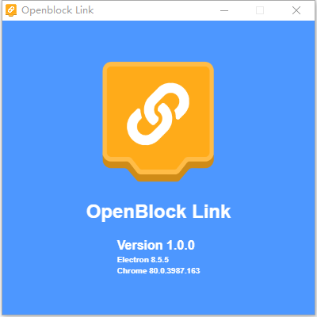
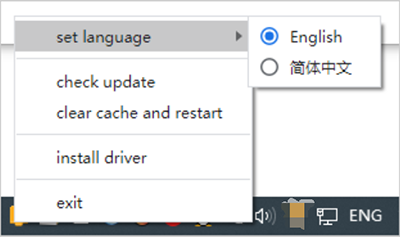

# openblock-link-desktop

    

OpenBlock Link is an application that provides local hardware connection support for OpenBlock online web pages.

## Getting Start

Visit the wiki: [https://openblockcc.github.io/wiki/main](https://openblockcc.github.io/wiki/main)

Visit the wiki on gitee (mirror): [https://openblockcc.gitee.io/wiki/main](https://openblockcc.gitee.io/wiki/main)

## Join chat

- Gitter: [https://gitter.im/openblockcc/community](https://gitter.im/openblockcc/community?utm_source=share-link&utm_medium=link&utm_campaign=share-link)

- QQ 群 (for chinese): 933484739

## Donate

Buy me a cup of coffee.

- Ko-fi (PayPal):

    

- 支付宝:

    

## Bug Report

You can submit the bug log in issues of this project.
